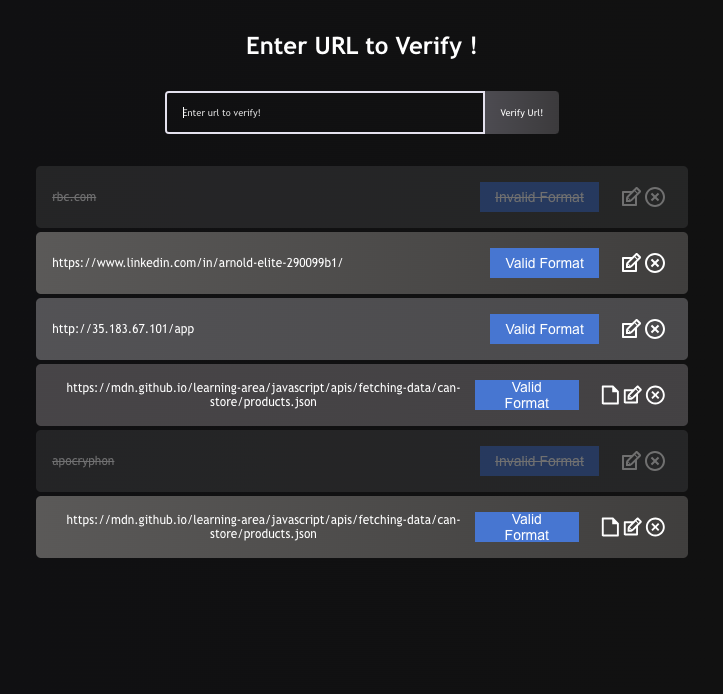

# Getting Started with Create React App

This project was bootstrapped with [Create React App](https://github.com/facebook/create-react-app).

## Available Scripts

In the project directory, you can run:

### `npm start`

Runs the app in the development mode.\
Open [http://localhost:3000](http://localhost:3000) to view it in your browser.

The page will reload when you make changes.\
You may also see any lint errors in the console.

### `npm test`

Launches the test runner in the interactive watch mode.\
See the section about [running tests](https://facebook.github.io/create-react-app/docs/running-tests) for more information.

### `npm run build`

Builds the app for production to the `build` folder.\
It correctly bundles React in production mode and optimizes the build for the best performance.

The build is minified and the filenames include the hashes.\
Your app is ready to be deployed!

See the section about [deployment](https://facebook.github.io/create-react-app/docs/deployment) for more information.

### `npm run eject`

**Note: this is a one-way operation. Once you `eject`, you can't go back!**

If you aren't satisfied with the build tool and configuration choices, you can `eject` at any time. This command will remove the single build dependency from your project.

Instead, it will copy all the configuration files and the transitive dependencies (webpack, Babel, ESLint, etc) right into your project so you have full control over them. All of the commands except `eject` will still work, but they will point to the copied scripts so you can tweak them. At this point you're on your own.

You don't have to ever use `eject`. The curated feature set is suitable for small and middle deployments, and you shouldn't feel obligated to use this feature. However we understand that this tool wouldn't be useful if you couldn't customize it when you are ready for it.

## Learn More

You can learn more in the [Create React App documentation](https://facebook.github.io/create-react-app/docs/getting-started).

To learn React, check out the [React documentation](https://reactjs.org/).

### Code Splitting

This section has moved here: [https://facebook.github.io/create-react-app/docs/code-splitting](https://facebook.github.io/create-react-app/docs/code-splitting)

### Analyzing the Bundle Size

This section has moved here: [https://facebook.github.io/create-react-app/docs/analyzing-the-bundle-size](https://facebook.github.io/create-react-app/docs/analyzing-the-bundle-size)

### Making a Progressive Web App

This section has moved here: [https://facebook.github.io/create-react-app/docs/making-a-progressive-web-app](https://facebook.github.io/create-react-app/docs/making-a-progressive-web-app)

### Advanced Configuration

This section has moved here: [https://facebook.github.io/create-react-app/docs/advanced-configuration](https://facebook.github.io/create-react-app/docs/advanced-configuration)

### Deployment

This section has moved here: [https://facebook.github.io/create-react-app/docs/deployment](https://facebook.github.io/create-react-app/docs/deployment)

### `npm run build` fails to minify

This section has moved here: [https://facebook.github.io/create-react-app/docs/troubleshooting#npm-run-build-fails-to-minify](https://facebook.github.io/create-react-app/docs/troubleshooting#npm-run-build-fails-to-minify)

### `Problem Statement`

You shall implement a very simple browser application in Javascript or Typescript that shall allow a user to check if an entered URL exists. The user shall be able to enter an URL and the URL must then be checked for valid format and if the format is correct it shall be sent to a server which provides the information if the URL exits and if it is a file or a folder. You shall not implement the server side, but just mock it on the client. The server call shall be asynchronous.
The check for the URL format and the existence check shall be triggered as the user is typing, but the existence check shall be throttled to avoid that too many server requests are done all the time.

1. check if url exists.
2. the User should be able to enter a url.
3. the entered url should be checked for valid format.
4.if format correct send to server ( to be mocked as an async function that returns a promise).
5. url format check and existence check should be triggered as user types, existence check should be throttled to avoid to many request to mocked server.

**Note: Solution**
     A URL ( Uniform Resource Locator) is the address of a given resource on the web. Typially, a URL consists of three parts. protocol, domain and path. For example: https://github.com/Arnoldelite using this URL as an example, the protocol is https, domain is github.com and the path is Arnoldelite.

	> My solution makes use of the semantic html input tag with type url to check the initial format of the URL as the user types. on submit, and after the intial format check, the string is sent to a handler that serves as the mocked server call. This function makes use of the new URL() default javascript constructor to check for the existence. it returns a boolean with the details of the URl i.e. host, domain and path and other usefull details or throw an error if the format is incorrect but because of our initial check with the semantic input html tag we would not get to that path.

	extra features to ease usability:
	- user can edit previous URLs in the form of notes.
	- user can delete previous verified or unverified urls.
	- unique visible identifier for unverified url.

